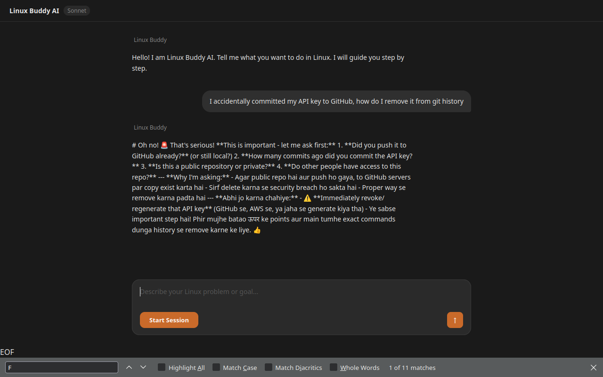
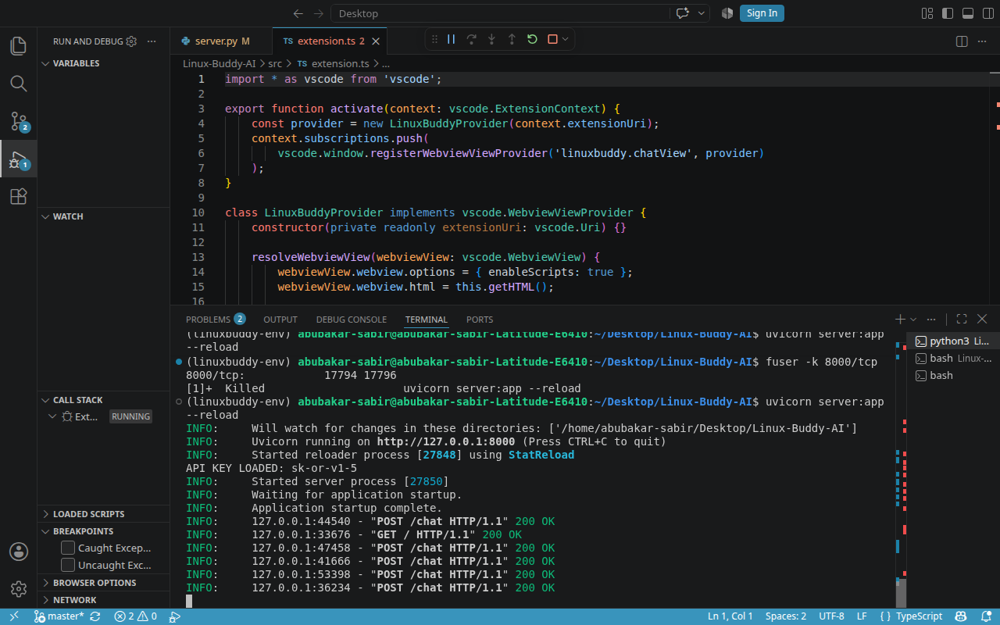

# Linux Buddy AI 🐧

> Your AI companion inside VS Code — guides you through Linux, step by step, so you actually learn.

## Why I built this

Most people think using AI is cheating. I disagree — but I also noticed a problem with myself.

While contributing to OpenPrinting CUPS (a real Linux production project), I kept copy-pasting terminal errors into AI tools. It was solving my problems — but I wasn't actually learning. The copy-paste habit was growing, not my skills.

I also remembered how I felt as a beginner. Terminal commands were scary. One cryptic error and you're lost — most beginners just give up at that point. I almost did too.

So I built Linux Buddy AI. A tool that sits right inside your VS Code, understands your Linux problem, and guides you one command at a time — but never lets you copy-paste. You read the command, you type it yourself, you learn.

No more beginners quitting because of a confusing terminal error.
No more developers building a copy-paste habit instead of real skills.
Just you, your terminal, and an AI that teaches instead of does.

## What it does

- 💬 *Chat first* — describe your Linux problem in plain English
- 🎯 *One step at a time* — AI gives one command, waits for you to run it
- 👁️ *Eyes ON/OFF* — toggle whether AI can see your terminal context
- 📚 *Learn while doing* — no copy-paste, you type every command yourself
- 🌐 *Works in browser too* — full web GUI available

## Screenshots








## Installation

```bash
git clone https://github.com/abubakarsabir924-cell/Linux-Buddy-AI.git
cd Linux-Buddy-AI
python3 -m venv linuxbuddy-env
source linuxbuddy-env/bin/activate
pip install requests rich fastapi uvicorn
Add your OpenRouter API key in server.py, then:
Bash uvicorn server:app --reload
Open http://127.0.0.1:8000 in your browser.
Tech Stack
Python + FastAPI (backend)
TypeScript + VS Code Extension API (sidebar)
Claude Haiku via OpenRouter (AI)
Vanilla JS + HTML (frontend)
Roadmap
[ ] Auto setup script (one command install)
[ ] Real terminal output capture (true "eyes" feature)
[ ] VS Code Marketplace publish
[ ] Multi-language support
About
Built by Abubakar Sabir Hussain — a self-taught developer from Pakistan.
Open source contributor to OpenPrinting CUPS — 11 PRs merged into production Linux printing infrastructure.
Made by a Pakistani self-taught developer who believes AI should be a teacher, not a crutch.
⭐ Star this repo if you believe in learning by doing!